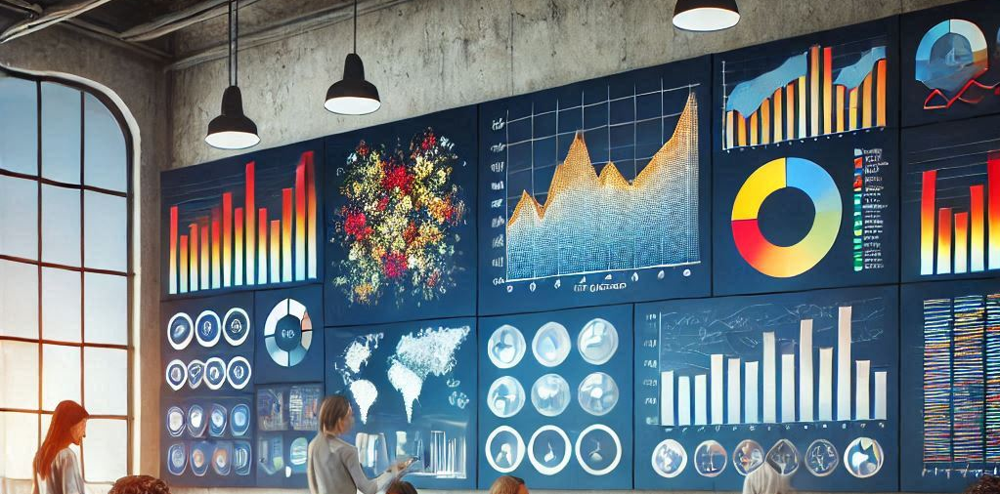
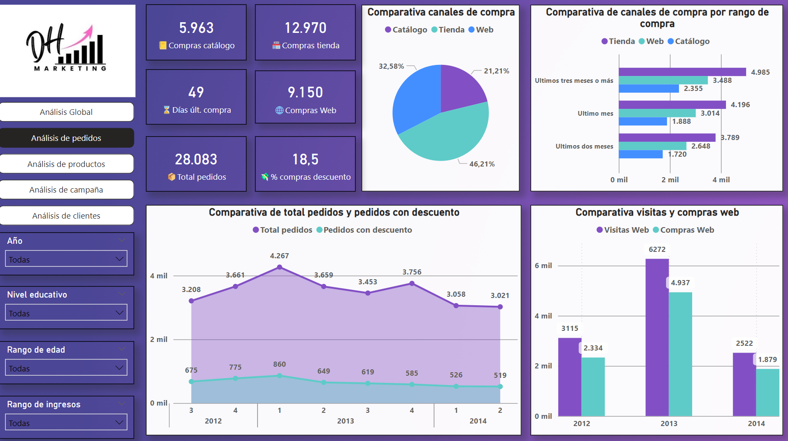
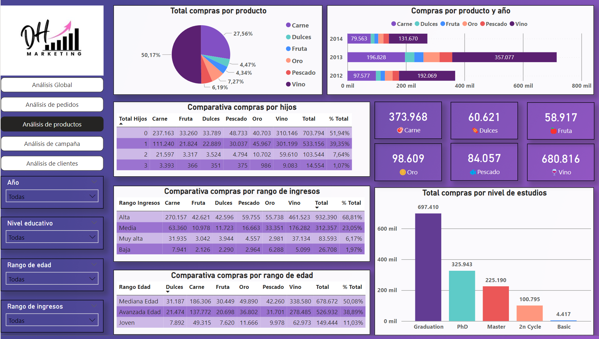
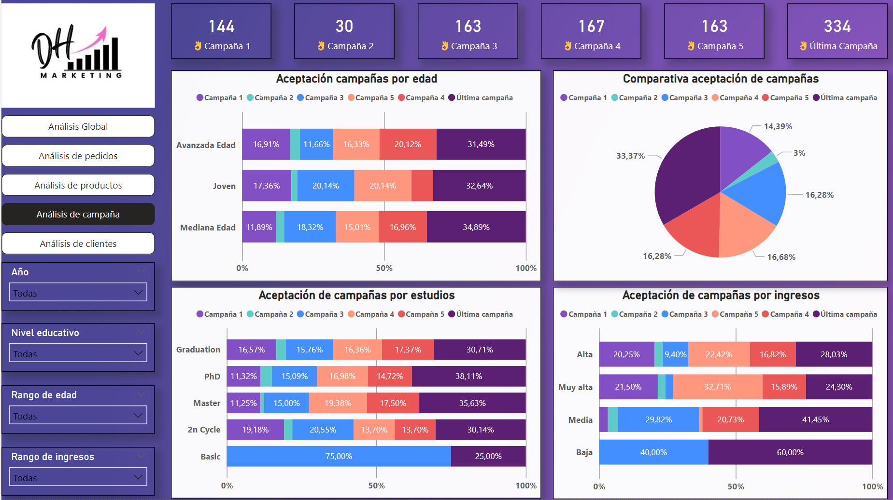
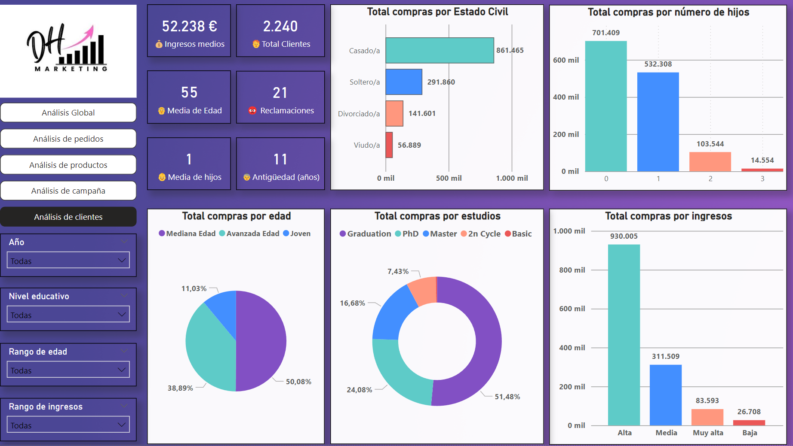

# 📊 Marketing Analysis Project

## 📌 Objectives

The objective of this project is to provide an interactive and detailed analysis of key marketing metrics to support strategic decision-making. This includes leveraging both Power BI for interactive dashboards and Python for data analysis, cleaning, and visualization.

## 🚀 Functionality

This project includes:
- 📈 **Interactive visualizations**: Pivot charts and tables in Power BI to explore data.
- 📊 **Key metrics**: Analysis of important KPIs such as sales, channels, products, complaints, campaign performance, and more.
- 📅 **Temporal analysis**: Trends over time to identify patterns and opportunities.
- 🗂️ **Five tabs in Power BI**:
  - 🌍 **Global**: General view of all metrics.
  - 📦 **Orders**: Detailed analysis of orders.
  - 🛍️ **Products**: Monitoring and analysis of different products.
  - 📢 **Campaigns**: Evaluation of marketing campaigns.
  - 👥 **Customers**: Customer information and analysis.
- 🐍 **Python Analysis**:
  - 🧹 **Data Cleaning**: Using pandas for data cleaning and preprocessing.
  - 📊 **Visualization**: Using matplotlib and seaborn for data visualization.
  - 🌐 **Interactive App**: A Streamlit app to present the results interactively.

## 🛠️ Tools Used

- 🖥️ **Power BI**: For creating the interactive dashboard.
- 🐍 **Python**: For data analysis.
  - 🐼 **pandas**: Data cleaning and preprocessing.
  - 📊 **matplotlib and seaborn**: Data visualization.
  - 🌐 **Streamlit**: Interactive app to present the results.

## 🔄 Development Process

1. 📥 **Extraction**: Data obtained from CSV files.
2. 🔄 **Transformation**:
   - 🖥️ **Power BI**:
     - 🔗 Combining tables using Power Query.
     - 🧹 Data cleaning: Removing duplicates, handling null values, and normalizing data.
     - 📈 Data enrichment: Adding calculated columns and transforming data to improve analysis.
   - 🐍 **Python**:
     - 🧹 Data cleaning with pandas: Removing duplicates, handling null values, and normalizing data.
     - 📈 Data enrichment: Adding calculated columns and transforming data to improve analysis.
3. 📤 **Load**:
   - 🖥️ **Power BI**: Integrating transformed data into Power BI for analysis and visualization.
   - 🐍 **Python**: Preparing data for visualization and analysis in Jupyter notebooks and Streamlit.

## 📈 Results

Various metrics have been created using **DAX (Data Analysis Expressions)** in Power BI to provide detailed and customized analysis:
- 📊 KPIs calculation.
- 📏 Calculated measures for specific analyses.
- ➕ Calculated columns to enrich the data.
- 🔍 Filtering and dynamic segmentation of data.

In Python, the analysis includes:
- 🧹 Detailed data cleaning processes.
- 📊 Creation of visualizations to explore and present data insights.
- 🌐 Development of an interactive Streamlit app to dynamically explore the results.

## 📊 Power BI Dashboard

Here are some screenshots of the Power BI dashboard:

<table>
  <tr>
    <td></td>
    <td></td>
  </tr>
  <tr>
    <td></td>
    <td></td>
  </tr>
</table>

## 📊 Visualizations

In addition to the Power BI dashboard, a complete analysis has been performed using Python, including:

- 🧹 **Data Cleaning with Pandas**: 
  - **Removing Duplicates**: Ensuring that the dataset is free from duplicate entries to maintain data integrity.
  - **Handling Missing Values**: Addressing missing data points through imputation or removal to ensure a complete dataset.

- 📊 **Data Visualization with Matplotlib and Seaborn**:
  - **Histograms and Bar Charts**: Visualizing the distribution of data and comparing different categories.
  - **Line Charts**: Analyzing trends over time to identify patterns and opportunities.
  - **Scatter Plots**: Exploring relationships between different variables to uncover correlations.
  - **Heatmaps**: Providing a visual representation of data density and relationships between variables.
  - **Box Plots**: Summarizing the distribution of data and identifying outliers.

## 📂 Project Structure

- 📁 `app/`: Streamlit app to present the results.
  - 📝 `main.py`: Main script for the Streamlit app.
  - 📄 `marketing_campaign_cleaned.csv`: Cleaned marketing campaign data.
- 📁 `assets/`: Directory for app assets like images and logos.
  - 🖼️ `menu.png`: Menu image.
  - 🖼️ `portada.png`: Cover image.
- 📁 `data/`: Directory for raw and processed data.
  - 📄 `marketing_campaign.csv`: Raw marketing campaign data.
  - 📄 `marketing_campaign_cleaned.csv`: Cleaned marketing campaign data.
- 📁 `images/`: Directory for Power BI screenshots.
  - 🖼️ `screenshot_1.png`: Power BI screenshot 1.
  - 🖼️ `screenshot_2.png`: Power BI screenshot 2.
  - 🖼️ `screenshot_3.png`: Power BI screenshot 3.
  - 🖼️ `screenshot_4.png`: Power BI screenshot 4.
  - 🖼️ `screenshot_5.png`: Power BI screenshot 5.
- 📁 `notebooks/`: Jupyter notebooks with the Python analysis.
  - 🧹 `data_cleaning.ipynb`: Notebook for data cleaning.
  - 📊 `data_visualization.ipynb`: Notebook for data visualization.
  - 📄 `marketing_campaign.csv`: Raw marketing campaign data.
  - 📄 `marketing_campaign_cleaned.csv`: Cleaned marketing campaign data.
- 📁 `powerbi/`: Directory for Power BI files.
  - 📄 `dashboard.pbix`: Main file of the Power BI dashboard.
- 🚫 `.gitignore`: Git ignore file.
- 📜 `LICENSE`: License file.
- 📄 `README.md`: Readme file.
- 📋 `requirements.txt`: Python dependencies file.

## 🌐 Web App

The interactive app created with Streamlit allows exploring the analysis results dynamically and accessibly. It includes features such as:
- 📊 **Interactive charts and graphs**: Visualize data through various types of charts and graphs that update in real-time based on user interactions.
- 🔍 **Filters to dynamically segment data**: Apply filters to the data to focus on specific segments, such as time periods, product categories, or customer demographics.
- 📈 **Detailed views of key metrics and trends**: Drill down into specific metrics to see detailed trends and insights, helping to identify patterns and opportunities.
- 🖥️ **User-friendly interface**: The app is designed to be intuitive and easy to use, making it accessible to users with varying levels of technical expertise.
- 🛠️ **Customizable dashboards**: Users can customize the dashboards to suit their needs, adding or removing widgets and adjusting the layout as required.

You can access the web app [here](https://marketing-analysis-project-upjsxxocyxzgfipqedl4zv.streamlit.app/).

## 📧 Contact

For any questions, you can contact me at:
- 📧 Email: jotaduranbon@gmail.com
- 💼 LinkedIn: [Juan Duran Bon](https://www.linkedin.com/in/juan-duran-bon)

## 💡 Suggestions and Contributions

Suggestions and contributions are welcome. Please open an issue or submit a pull request to discuss any changes you would like to make. Here are some ways you can contribute:
- 🐛 **Report Bugs**: If you find any bugs, please report them by opening an issue.
- 🌟 **Feature Requests**: If you have ideas for new features, feel free to suggest them.
- 💻 **Code Contributions**: You can contribute by fixing bugs, adding new features, or improving the documentation.
- 📝 **Feedback**: Any feedback to improve the project is highly appreciated.

## 📜 License

This project is licensed under the MIT License. See the [LICENSE](./LICENSE) file for more details.
